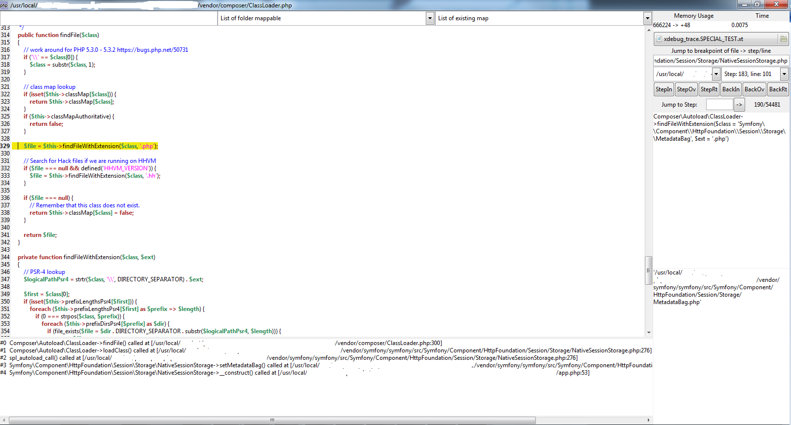

GTK-XdTrace Xdebug trace file viewer
===========

Make usage of xdebug trace file almost as like a coredump for C language. You can load a trace file and navigate throw the source code of your application in a similar way of a debugger.

But, trace file will only show function call. Then unlike debugger that will show all instructions, you will only navigate throw function call.
Despite that, I believe it give a good overview of where we passed in the source code.

For example if you have source code like that :

<pre><code>
$test = calltofunc();

if($test) {
    $res = 0;
} else {
    $res = 1;
}

calltofunc2($res);
</code></pre>

trace file will only show you lines $test = calltofunc(); and calltofunc2($res);

But as you know what is parameters value and return value of functions, you can mostly guessed where you passed.

I recommend that configuration for Xdebug trace parameters :

<pre>
xdebug.trace_enable_trigger = 1
xdebug.trace_format = 1
xdebug.trace_output_name = "xdebug_trace.%p.%s.%u"
xdebug.collect_params = 4
xdebug.show_mem_delta = 1
xdebug.collect_return = 1
</pre>

Be careful, when collecting parameters, execution time will be much more longer and size of the file could be several 100MB.
Then I set in the windows release a memory limit of 2GB. Expect a loading time of few seconds for a file of 50MB.

A progress bar will indicate you the loading speed.

Also in php.ini of your application, when using trace, you should set a higher max execution time than 30s to not miss end of the trace file.

To view source file, all files must be in same folder than when the file trace was generated or you will need to add mapping of path between your local machine and origin machine.

Each step represent a function call and they are ordered according to the normal progression in the code.

A function call can be internal PHP function or user land PHP function.

Important information on the Jump to breakpoint of file->step/line. It will only show the first time you pass on the line of the file.
For example it means that if you have a loop on a function calling 100 times that function from the same line of code then you will only see one occurrence in the list.
Another example would be simply you call from 2 different places the same piece of code so only the first time you pass in will be reported in the list.

This is in order to prevent unlimited size list which would make it unusable whatever.

Interface looks like that :

Known bug:

Currently when loading a file generated in trace_format = 0 the new functionality "Stats" is not accurate and should be used carefully.
When a function return no value (void) the file does not generate any return value so the function exit status for memory usage and time spent is missed.
It may create negative time report in the "own time" report.

However it does not affect the "debugger" mode.

The memory usage is also known to be imperfect due to the difficulty to profile what happen when the garbage collector of PHP is activated (according to Derick @xdebug)
Then the report may show also negative values.

I would recommend to use those values more as a tendency for proportion than a very accurate number.
